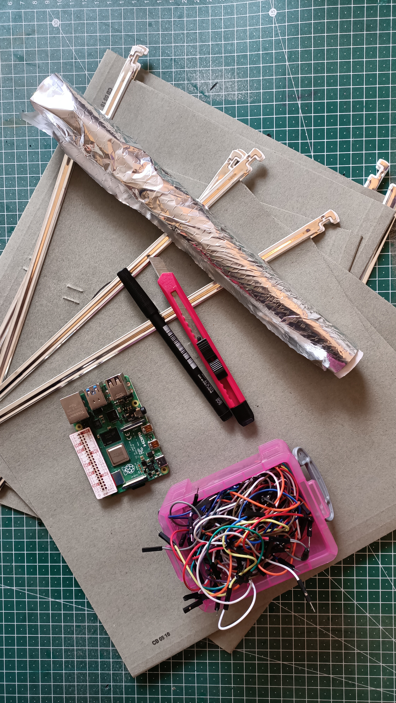
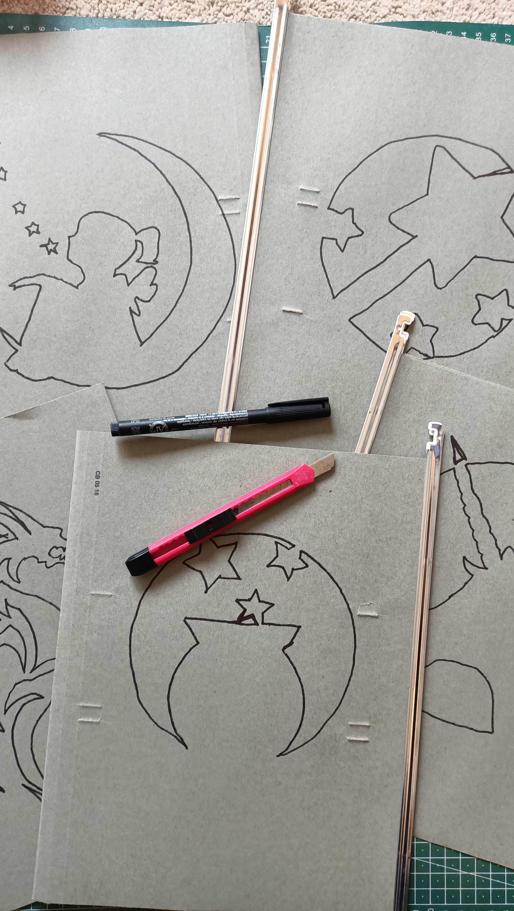
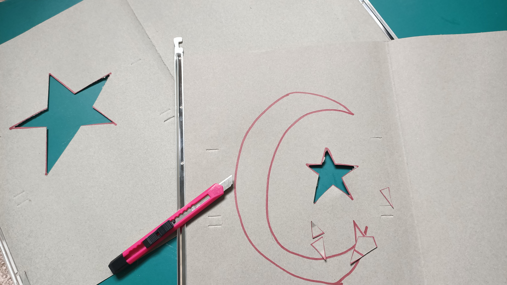
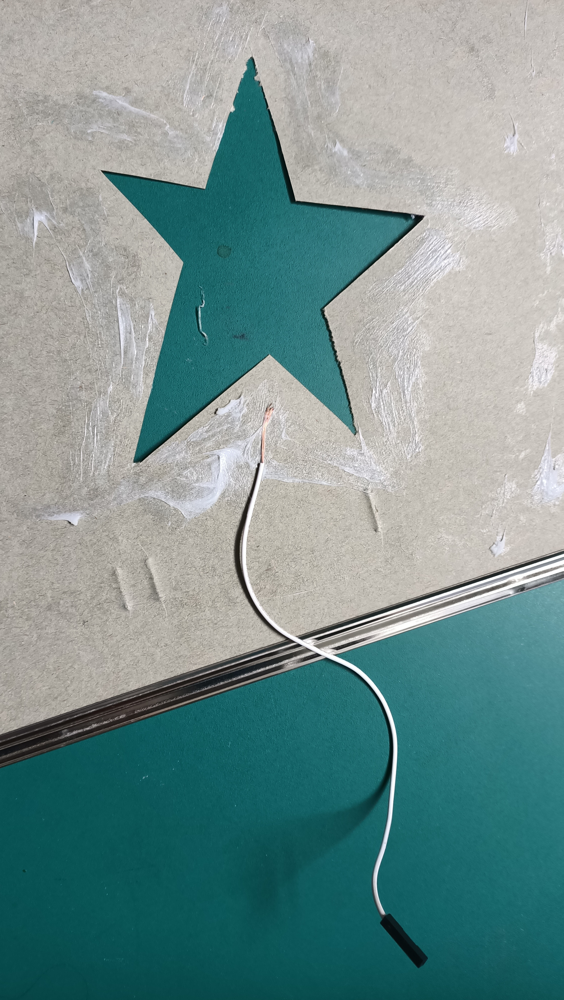
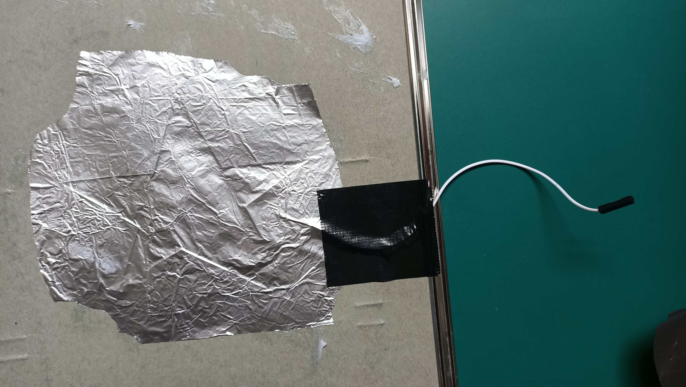
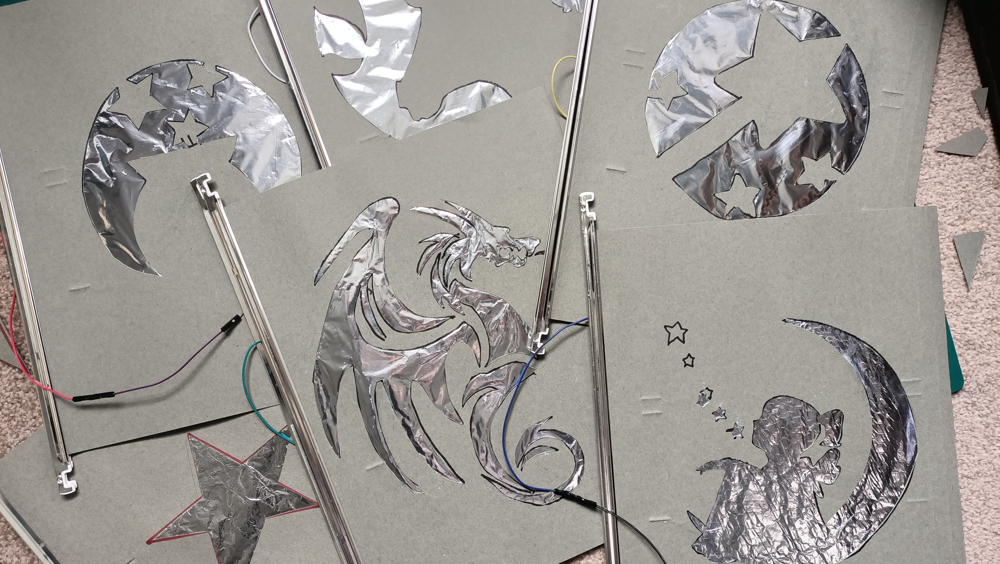
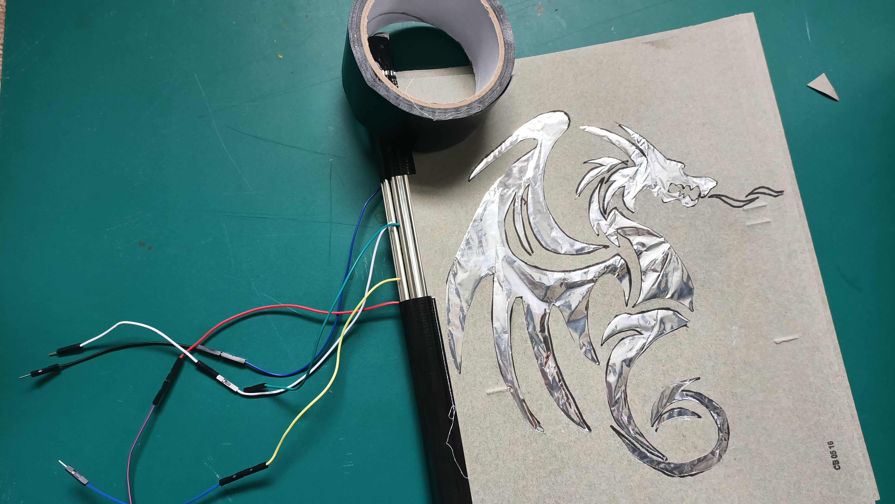
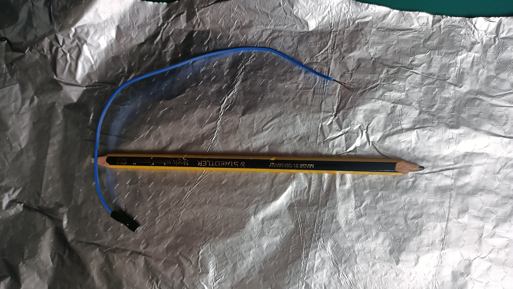
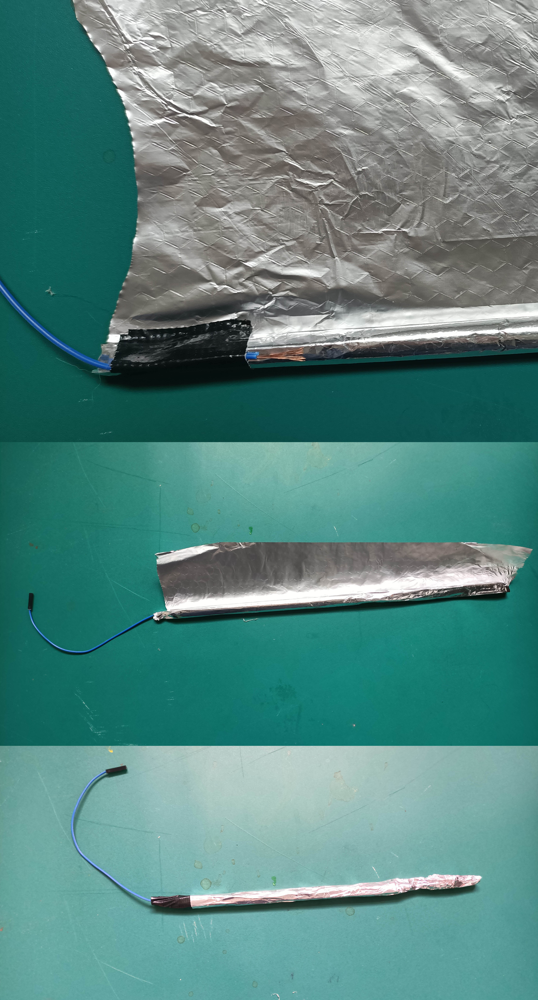
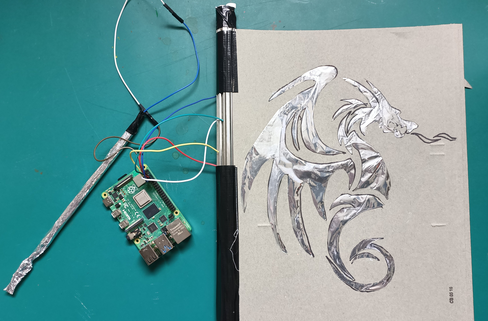

## Make your pages

Once you have some ideas for the story and ways to interact with your book, you can start to  make the pages.

--- task ---
Decide how many pages you will need for your electronic book. You could have one per backdrop, or just a cover and a single inside page with multiple buttons.

Decide what your interaction tool will look like. This is the thing your reader will touch to the pages to activate the book. It might be a magic wand, a star, or anything you like!
--- /task ---

Each page needs to have a back and a front made of cardboard (or other non-conductive material), with internal contacts made from aluminium foil.

--- task ---
Gather or cut the needed amount of cardboard for your book's pages.

If you are using cardboard, you need to cut out a back and a front piece for each page. If you are using manila folders, envelopes, or similar items, you can use one per page.
--- /task ---

The front side of each page needs to have a simple design that relates to what is happening in your book. You will cut these designs out of each page and replace them with foil. The foil will be connected to the Raspberry Pi's general purpose (GP) pins to create buttons for your reader to interact with.

--- task ---
Draw the designs you want on each page. Keep them fairly simple, as more complex shapes may not work well. You can search online for 'stencil' images to see some good examples. 

--- /task ---

--- task ---
Once you have drawn all the designs you need on the front side of each page, cut them out using a craft knife or scissors. Make sure you get permission from an adult to use sharp tools.

--- /task --- 

--- task ---
Take your F-F jumper wires and remove one of the ends by pulling it off using a little force. You do this to expose the internal core of the wire.
--- /task ---

--- task ---
Turn your cut-out image over so you are looking at the back (or the inside of your manila folder).

Now coat the edges of the cut-out picture with glue, and press the exposed end of the wire to the sticky surface, with the F end hanging out toward where the spine of your book will be.

--- collapse ---
---
title: I'm making more than one button per page! 
---
If you are making multiple buttons on each page, you must **make sure that your foil pieces are not touching**, otherwise you will get a short circuit.

You also need to add a new wire for each button. Keep them as close together as you can, as this will make it easier to connect them to the Raspberry Pi later. 
--- /collapse ---

--- /task ---

--- task ---
Tear off a sheet of foil and place it over the cut-out, pressing it down firmly on the sticky surface to make sure it is stuck all over. 

Tape down the free end of the wire as close to the spine as you can to keep it from pulling loose.
--- /task ---

--- task ---
Coat the piece of cardboard that will be the back of the page with glue. Press it down firmly onto the front piece to finish the page. The foil and wire should be sandwiched between the two pieces of cardboard. 

If you like, you can also tape the edges of your page closed for extra durability.
--- /task ---

--- task ---
Repeat these steps for each of your pages, then bind them together along the spine using strong tape to make a book.

--- /task ---

Once you have your book completed, you need to create your interaction tool; this tool will allow the reader to press the buttons because it acts as a **common ground** contact that can close the circuit for each of the cut-out pictures. 

In this example, I am making a magic wand as an interaction tool. For your tool, you can cut any shape you like from cardboard to wrap in foil, or simply have a look in the recycling bin for something suitable to wrap in foil.

--- task ---
Cut your desired shape for your interaction tool from cardboard (or reuse a discarded item from the recycling bin).

In the example, I am just going to wrap a pencil in foil to create my magic wand.

--- /task ---

--- task ---
Pull the end off an F-F wire and glue or tape it down firmly to the base of the interaction tool, with the free end hanging toward where the user will grip the tool. Then wrap the tool in aluminium foil and secure the base with more glue or tape.

--- /task ---

--- task ---
Connect your pages and interaction tool to your Raspberry Pi's GPIO pins, taking note of which pins you connect to. You could also use some M-F jumper cables to extend your wires if you want to make it easier to use the book.

In the example, the pages are connected to Pins 2, 3, 4, 14, and 15, while the magic wand interaction tool is connected to GND (ground) pin 6.
--- /task ---

Once you have your book and interaction tool wired up, it's time to write the code!
