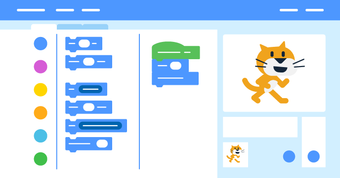

## Checklist

Did you meet the project brief? Think about your project and go through the checklist below and check off the ones that apply to your project.

Does your book have:

--- task ---
Multiple pages with a way to turn to the next page
--- /task ---
--- task ---
At least one sprite
--- /task ---
--- task ---
Different actions on every page
--- /task ---
--- task ---
Speech or sound effects
--- /task ---

Your book could also have:

--- task ---
Changing backdrops for each page 
--- /task ---
--- task ---
Text or art created in the Paint editor
--- /task ---
--- task ---
Multiple interactive features on each page
--- /task ---

Reflecting about how you made your book will help you in your future projects:

--- task ---
How did you get your ideas?
--- /task ---

--- task ---
What cool new thing(s) did you learn? 
--- /task ---

You are now the author of an electronic book!
Take a moment to celebrate what you have made.

--- task ---

Where will you take your new powers? What will you make next?

--- /task ---

